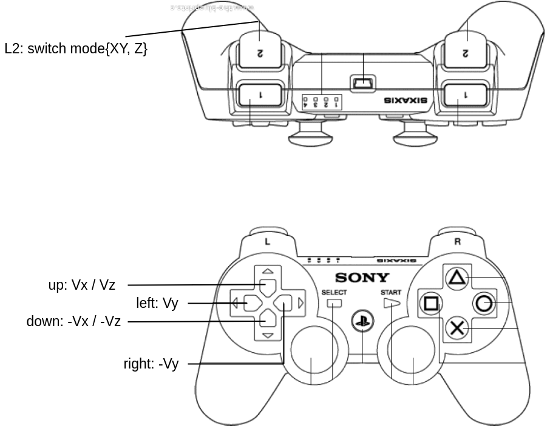

# User container for the Origin's robot arm integration kit

The [user container](https://github.com/avular-robotics/user-container.git) is an example of how a user may create a docker container that can be used to develop on the Origin. It comes pre-installed with ROS and the necessary dependencies to develop for the Origin.

This branch continues on that example by illustrating the software integration of the Origin One with the Kinova robot arm. It assumes that you have acquired the Origin One and a Kinova robot arm, and that you established a hardware integration of the two such that the robot arm is powered from the robot and that the ethernet port of the robot is connected to the ethernet port of the Origin One.

> [!IMPORTANT]
> It is further assumed that the ip-address of the robot arm is configured as `192.168.100.200` and that it was configured with a so-called protection zone around the 3D-LiDAR of Origin One (in case you have an Origin One with such a Lidar).

This guide will walk you through how to use the user container to develop on the Origin One in combination with the Kinova robot arm.

## Setting up the user container
The user container is available on the Origin by default at `/data/user/containers`. If you want to update the user container files, or restore the user container to its default state, you can follow the following steps:

1. SSH into the Origin
> [!WARNING]
> The next step will remove all files in the user container directory. Make sure to back up any files you want to keep.
2. Remove the current user container files
   
    ```bash
    rm -rf /data/user/containers
    ```

3. Clone the user container files to the Origin
    ```bash
    git clone --branch origin/origin_kinova_arm https://github.com/avular-robotics/user-container.git /data/user/containers
    ```
4. Building the user containers
    ```bash
    cd /data/user/containers
    docker compose build
    ```
## Exploring the container files
Some important files of this container directory are:

- A `Dockerfile` defining the installed dependencies of in the container in order to build the docker image.
- A `docker-compose.yml` defining the parameters and variables with which the docker container is started, after which the container is named "origin_kinova".
- A `origin-msgs_arm64_x.y.z.deb` being the debian installation file by which the docker container will be able to interface with the ROS2 network of the Origin One.
- A `kortex_api-2.6.0.post3-py3-none-any.whl` being a download file of the Kinova Api, obtained from their git-repo, that is pre-installed in the "origin_kinova" container as well.

The files are used to create the docker image and then run the docker image as a docker compose. Additionally, the directory also contains a workspace directory, i.e., `ws`, in which you will the python examples provided by Kinova to interact with their robotic arm as well as a `src` folder containing the ROS2 package "origin_kinova_example". Within this package, among other, there is:

- A ROS2 python node, called `control_kinova.py`, which defines a ROS2 node that subscribes to the PS-controller of the Origin One to read out its joystick values, and sents velocity commands to the robot arm in either the TOOLS frame or the BASE frame of the arm.
- A ROS2 launch scripts, called `control_kinova.launch.py`, by which the above ROS2 node can be launched.

This workspace folder `ws` is mounted from the local directory of the robot's onboard PC, i.e., `/data/user/containers` into the "origin_kinova" docker container at the location `/home/user/ws`. Therefore, any changes you make in this workspace, for example adding your own ROS2 packages to the `src` directory, will immediately be available inside the docker container and vice versa.

## Running your first example
First of all, you need to start the "origin_kinova" docker container. You can do this by running the following command:
```bash
cd /data/user/containers
docker compose up -d
```

To enter the user container, you can run the following command:
```bash
docker exec -it origin_kinova /bin/bash
```
You will enter the docker container in your workspace folder, i.e., in `/home/user/ws`.

Since the Kinova examples have been copied to the workspace folder, the easiest way to move your robot arm using the Origin One is to enter the docker container, go to the directory of the python examples and run one of them, for example:

```bash
cd kinova_api_python/examples/102-Movement_high_level
python3 03-twist_command.py
```

However, in case you want to control the robot arm in combination with the Origin One, then you may need to combine the information of the ROS2 network of the Origin with control commands of the robot arm. The ROS2 package `origin_kinova_example` located in the src-folder presents such an example. Note that the workspace is not yet build as a ROS2 workspace, which means that in order to run the example you will need to enter the "origin_kinova" container, which you will enter in the container's workspace directory `home/user/ws`, and then build the ROS2 workspace as follows:

```bash
colcon build --symlink-install
source install/setup.bash
ros2 launch origin_kinova_example control_kinova.launch.py
```

This will launch a ROS2 node that subscribes to the joystick commands of the Origin One in order to sent linear velocities in either the robot's TOOLS frame or BASE frame. More specifically, velocities of the arm in de X, Y and Z directions are c determined as follows:

- Without pressing the "L2" button:

    - The "up" and "down" buttons on the PS controller define the linear speed in the X direction.
    - The "left" and "right" buttons on the PS controller define the linear speed in the Y direction.

- While (continuously) pressing the "L2" button:

    - The "up" and "down" buttons on the PS controller define the linear speed in the Z direction.

 {width=300; style="display: block; margin: 0 auto"} 

Please have a deeper look inside the python code of this ROS2 node `control_kinova.py`. For example to change the frame of the speed from TOOL to BASE frame. Also, it will help you in creating your own ROS2 nodes and packages by which you simultaneously interact with Kinova robot arm and the ROS2 network of the Origin.

## Using the user container for development
We suggest that you do all your development inside the user container. This will ensure that your code runs on the Origin as expected and will not be lost when the Origin is updated.

First of all, you need to start the user container. You can do this by running the following command:
```bash
cd /data/user/containers
docker compose up -d
```

To enter the user container, you can run the following command:
```bash
docker exec -it user /bin/bash
```

You can now start developing on the Origin. In the container, we have a user named `user`. 
This user has sudo rights, so you can install packages and run commands as root. When entering 
the container, you will be in the `/home/user/ws` directory. This is the workspace directory 
where you can start developing your code. This workspace directory is also mounted from the host OS,
this is done so that you can easily `down` and `up` the container without losing your code. 

> [!WARNING]
> Be aware that recreating the container will remove all files outside the workspace directory.

### Installing packages
You probably want to install some packages to develop your code. To test out if the package works you
can just install it in the container. If you are happy with the package you can add it to the `Dockerfile`.
After adding the package to the `Dockerfile` you need to rebuild the container. You can do this by running
the following command from the `/data/user/containers` directory:
```bash
docker compose up -d --build
```
